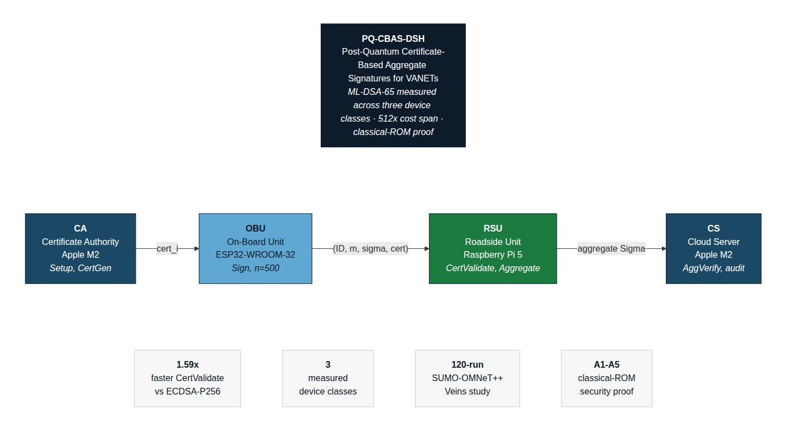

# PQ-CBAS-DSH — Research Artifact

[](https://doi.org/10.5281/zenodo.21805963)



Reproducible source code and measurement artifact for:

> **What Post-Quantum Authentication Costs in a VANET: Measuring ML-DSA-65 Across Device Classes in a Certificate-Based Batched-Verification Framework**
> Asroni, Selo Sulistyo, Sigit B. Wibowo — submitted to *Vehicular Communications*.

Measurements cover three directly measured device classes: desktop-class Apple silicon (CA/CS), a microcontroller-class ESP32 (OBU), and an embedded Linux-class Raspberry Pi 5 (RSU).

## Contents

```
src/         measurement code (Python)
esp32/       microcontroller-class OBU benchmark (Arduino IDE)
sumo/        StudyArea network, demand, and SUMO configuration
scripts/     run wrappers and release checks
results/     raw outputs underlying Tables 5-13 (Apple M2, ESP32, and
             Raspberry Pi 5 device classes; see results/rpi5_20260928/)
docs/        platform setup guides (docs/RPI_GUIDE.md)
```

The manuscript source (LaTeX) is not required to run the artifact.

## Requirements

| Component | Version / requirement |
|---|---|
| Python | 3.11+ |
| liboqs | 0.15.0 (pinned for manuscript reproduction on desktop/RSU hosts) |
| liboqs-python | 0.16.0.1 (prebuilt ARM64 wheel from piwheels.org on Raspberry Pi; see `docs/RPI_GUIDE.md`) |
| numpy | see `requirements.txt` |
| SUMO | 1.26 (mobility trace) / 1.22.0 (OMNeT++/Veins coupling) |
| OMNeT++ | 6.1 |
| Veins | 5.3.1 |
| ESP32 toolchain | ESP-IDF v5.5.5 (PQClean reference ML-DSA-65) |

Install Python dependencies:

```bash
pip install -r requirements.txt
```

## Reproducing the results

```bash
# Build liboqs and run the operation-level benchmark, aggregation behavior,
# and security experiments (Tables 5, 7-8, 17-18) on a desktop-class host
bash scripts/run_bench.sh

# End-to-end latency, uniform arrivals (Tables 9-10)
bash scripts/run_seeds.sh 20 90

# End-to-end latency on the SUMO mobility trace (Table 13)
python3 src/sumo_pqcbas_bridge.py --window 90 --seeds 20

# Transport-inclusive latency budget (analytic model, Section 7.8)
python3 src/transport_budget.py

# RSU-class hardware measurement (Table 5 third column, Table 8) on a
# Raspberry Pi — see docs/RPI_GUIDE.md for setup. A completed run is
# archived at results/rpi5_20260928/.
bash scripts/run_rpi.sh 20 90

# Microcontroller-class OBU benchmark (Table 6): flash and run
# esp32/PQCBAS_ESP32_Bench/PQCBAS_ESP32_Bench.ino via the Arduino IDE
```

All reported values in the manuscript can be regenerated from these scripts.
Confidence intervals use a Student-t multiplier at df = n-1 throughout.

The 120-run SUMO--OMNeT++--Veins transport-inclusive confirmatory evaluation
(Table 20, Section 7.13 of the manuscript) is not yet included in `results/`
and will be added to this repository and the permanent archive DOI upon
acceptance, per the manuscript's Data Availability statement.

## Verifying integrity

```bash
sha256sum -c SHA256SUMS.txt
```

## Citation

If you use this artifact, please cite the manuscript (see `CITATION.cff`).

## License

See `LICENSE`.
